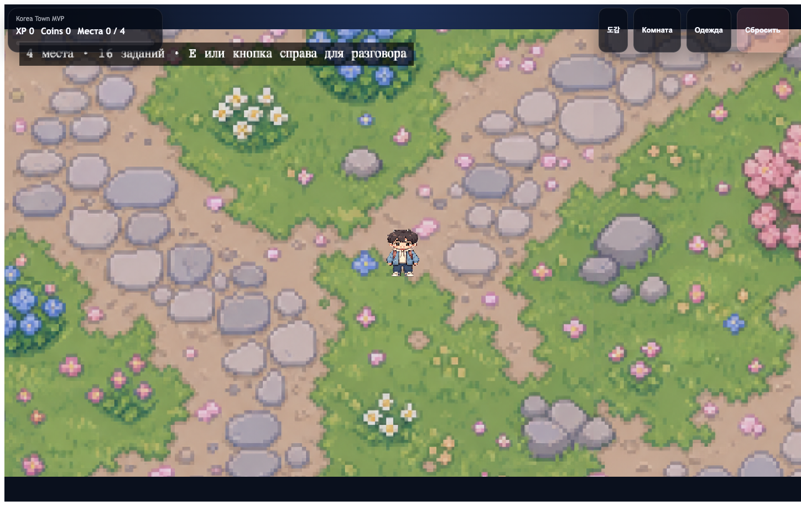
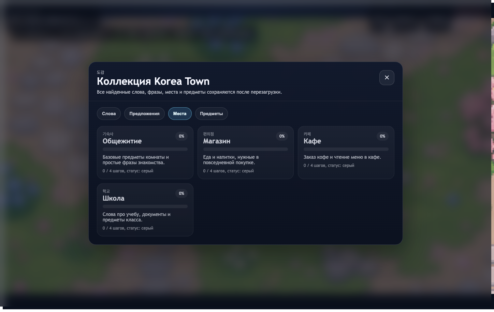

# Korea Town MVP

`React + TypeScript + Phaser 3`로 만든 Korea Town 생활형 한국어 학습 MVP입니다.

플레이어는 마을을 이동하면서 NPC와 대화하고, 퀴즈를 풀고, 어휘와 문장을 해금하고, 장소의 회색 상태를 색으로 복원하고, 도감을 수집하고, 방을 꾸미고, 의상을 바꿀 수 있습니다.

## 현재 구현 상태

- 4개 장소: 기숙사, 편의점, 카페, 학교
- 4명의 NPC: 유나, 민수, 지훈, 소라
- 16개 상호작용: 각 NPC마다 인사, 2개 퀴즈, 마무리
- `src/content/vocabulary.ts`에 24개 어휘
- 장소 완료 전후를 보여주는 회색 → 색상 상태
- 장소별 진행률과 전체 진행률 표시
- 4개 탭으로 구성된 `도감`: 단어, 문장, 장소, 아이템
- 6개 슬롯의 방 꾸미기
- 3종 의상 패널
- coins로 가구와 의상 구매
- 진행 상태, 방, 의상, 컬렉션을 `localStorage`에 저장
- 모바일 조작: 가상 조이스틱과 `E / 대화` 버튼

## 스크린샷

스크린샷은 현재 로컬 빌드 기준으로 갱신되어 있습니다.





## 조작 방법

### Desktop

- `WASD` 또는 방향키: 이동
- `Shift`: 빠른 이동
- `E`: 상호작용
- `Esc`: 현재 패널 닫기
- `F3`: 디버그 오버레이

### Mobile

- 왼쪽 가상 조이스틱: 이동
- 오른쪽 `E / 대화` 버튼: 상호작용

## 로컬 실행

```bash
npm install
npm run dev
```

프로덕션 미리보기:

```bash
npm run build
npm run preview
```

## 프로젝트 구조

- `src/game/` — Phaser 씬, 엔티티, 상호작용 로직
- `src/components/` — React UI: 대화, 퀴즈, 컬렉션, 방, 의상, 모바일 컨트롤
- `src/content/` — NPC, 장소, 아이템, 문장, 어휘 데이터
- `src/store/` — Zustand store와 저장 로직
- `public/assets/` — 배경, 건물, 스프라이트

## 주요 데이터

주요 데이터는 다음 파일에 있습니다.

- `src/content/interactions.ts`
- `src/content/vocabulary.ts`

`interactions.ts`에는 다음이 들어 있습니다.

- 장소와 NPC 설정
- 16개 상호작용
- 가구, 기념품, 의상 카탈로그
- 방 슬롯
- 컬렉션용 문장 목록

## 저장

이 게임은 Zustand `persist`를 사용하며 상태를 다음 키로 저장합니다.

```txt
korea-town-storage
```

저장되는 항목:

- XP와 coins
- 완료한 상호작용
- 컬렉션의 단어, 문장, 장소, 아이템
- 구매한 가구
- 구매 및 해금된 의상
- 선택된 outfit
- 방 슬롯 배치
- review list

## 배포

배포용 설정 파일이 준비되어 있습니다.

- `netlify.toml`
- `.github/workflows/deploy-netlify.yml`

Netlify 자동 배포를 사용하려면 다음이 필요합니다.

- `main` 브랜치가 있는 Git 저장소
- `NETLIFY_AUTH_TOKEN` secret
- `NETLIFY_SITE_ID` secret

저장소를 연결하면 `main`으로 push할 때 `dist/`가 배포됩니다.

## 검증 상태

2026-08-05 기준으로 다음을 확인했습니다.

- `npm run build` 성공
- 로컬 preview에서 치명적인 console error 없음
- 스크린샷 갱신 완료

## 저장소

GitHub 저장소:

- [dchumov/koreantowngame](https://github.com/dchumov/koreantowngame)

